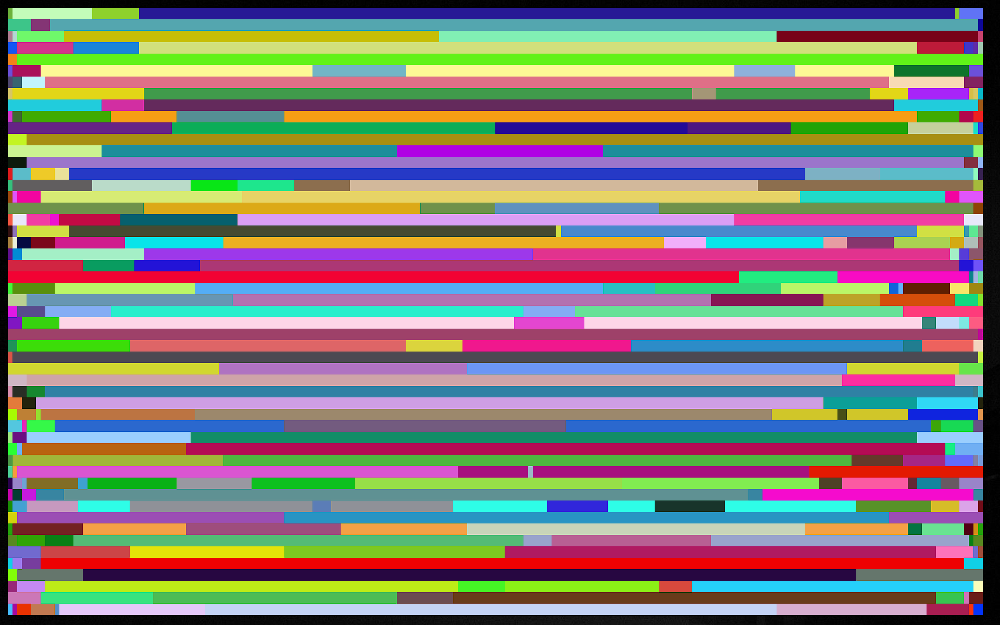
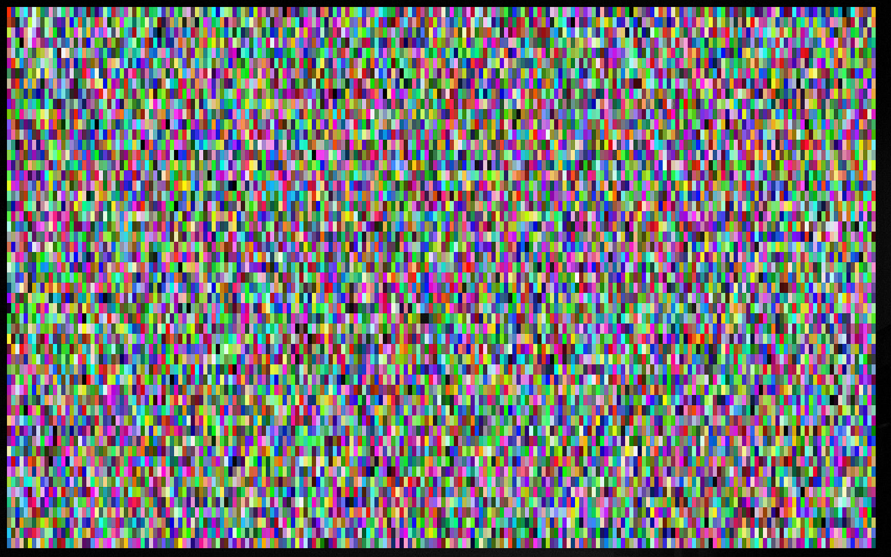

***This project is*** ![Under Construction](https://img.shields.io/static/v1?logo=data:image/png;base64,iVBORw0KGgoAAAANSUhEUgAAAA4AAAAOCAYAAAAfSC3RAAACmElEQVQokUWSa0iTcRTGn//26u4b6ZQ0U8lKMqykwPpgZVBEHyLp8jEoIZJADCQ0iCiStIwuZmHRioIuroQss2VkrkIrdeFckiZqdhctTXPOve8Tr7M6X8/zO+fwPEfIwy7IwQA0GgExGYQwyhCmMLRX1z2hJCJSN+xZgqAZnPgCaAUQ0EHICjSYLlKBCDdNQb7HLmeRoy3zQFnzYk/1WTckGUIXCVD+Kw+BpAxtuBXCpkN7bdXt/JL3W3J3xuHg3iTsL/NkNFWVPoWkQOj/wxooCrRhFgiTjI4n9ZVHHQObjxVEY8UGIi1zEhVFCahwdq5qvn+hHkKC0EcBigxwvAnkW3ge7L6TMi+VztOLOOKOY8ulKL68GM2emnjeLF3AZSlz2FCZ6yaHwLGv6pkv8MyxsUoHLcsLwBuHwE0rtdy2UuLWNTpmpkkszQEfnAPDAd47tbaB7NaJR+eXujfmtGTUXgFWp5uwPd8Oi1GBJEmwWYlP34L4PSFw7chPeD+MYnkWUVmy0CeNfe5N8ANIjNWpNmHzqklYrDIGRwRm2gXsM/xofRMOf1AgcbYOAfgxMvgxCmS9+dbh5A6VarxuIMdBDoJ0g+vSreytNpAEux7qqWrK82I+kC2xYOAzyFbz5QNJPrXhdRo4XK/n3WILkxPsbKqwsr8xBB3PjukhGyJJv+qqB+QvkN0mR2Fim5pU1hobzxTYOPbcyJoTNpoAlu6wdZKvIslR0O9VXe0Clc5p2Ge4WDh36ux3ThM/1RqnNhXvilU32cjvINtAf4cKdkzlSHpBTqgNY11JfLtFA+o14NU8Wx/piggNfg2yGVR8EF9/dP37PyCIoDQLs8z9hmv71nsC4wFz9klX2tD4/AEG+gBoQ7KghD8MZ2xdnt7s7wAAAABJRU5ErkJggg==&label=Under&message=Construction&style=for-the-badge&labelColor=1D1D1D&color=ffff99), but coming very soon.

# Speckler Powershell 


---

## About

Powershell version of my speckler program.
I will be releasing a more performant cross-platform C++ version soon.

### Description

Fun little script to randomly paint colored squares on the screen in a Powershell command line (though you can call it in CMD via calling `pwsh -File .\speckler.ps1`).

### Motivation

I love fun in the command line and have written many similar type scripts and programs over the years and this is just another version/variation. This one is a bit inspired by my last major project of this kind [ColorStatic](https://github.com/Lateralus138/colorstatic) (although this is old, unoptimized, and I plan to rewite it).

---

## Usage

### Environment

***Windows Powershell/PWSH*** and *CMD*.

### How To Use

Place the script in one of your personal script/bin folders (that is in `$Env:PATH` or `%PATH%`) to run globally without a path (`speckler -Sleep 10` for example) or use the full path of the script as usual.

### How To Get

Either download one of ths scripts (speckler.ps1 is for PWSH ..._compat.sp1 is for older versions of Powershell (5.0)) from the [src](./src/) directory or copy the code from here and paste in a script file:


```Powershell
<#
  .SYNOPSIS
  Fun with colors in Powershell.
  .DESCRIPTION
  Color tv static style fun in the Powershell command line. Similar to my old ColorStatic C++ program.
  Speckler in C++ coming soon.
  .PARAMETER MinWidth
  Minimum width of each color square.
  .PARAMETER MaxWidth
  Maximum width of each color square.
  .PARAMETER Sleep
  Delay between each iteration, Defaults to 0.
  .EXAMPLE
  speckler -MinWidth 1 -MaxWidth 1
  .EXAMPLE
  speckler # of course
  .EXAMPLE
  $width = ($Host.UI.RawUI.WindowSize.Width / 4)
  speckler -MaxWidth $width
#>
param(
  [ValidateScript({ ($_ -ge 1) -and ($_ -le $Host.UI.RawUI.WindowSize.Width) })]
  [Int]$MaxWidth = $Host.UI.RawUI.WindowSize.Width,
  [ValidateScript({ ($_ -ge 1) -and ($_ -le $Host.UI.RawUI.WindowSize.Width) })]
  [Int]$MinWidth = 1,
  [ValidateScript({ $_ -gt 0 })]
  [Int]$Sleep = 0
)
if ($MinWidth -gt $MaxWidth) {
  Write-Error "MinWidth [$MinWidth] can not be greater the MaxWidth [$MaxWidth]."
  return
}
while ($true){
  $Width = switch ($MinWidth -ne $MaxWidth) {
    $true { Get-SecureRandom -Minimum $MinWidth -Maximum $MaxWidth }
    default { $MinWidth }
  }
  [console]::SetCursorPosition(
    $(Get-SecureRandom -Minimum 0 -Maximum $($Host.UI.RawUI.WindowSize.Width - $Width)),
    $(Get-SecureRandom -Minimum 0 -Maximum $($Host.UI.RawUI.WindowSize.Height - 1))
  )
  ColorSquare -Value $(Get-SecureRandom -Minimum 0x000000 -Maximum 0xffffff) -Width $Width
  if ($Sleep -gt 0){
    Start-Sleep -Milliseconds $Sleep
  }
}

or old Powershell:

```Powershell
# ╔═══════════╗
# ║ Functions ║
# ╚═══════════╝
function Validate8Bit { param([Int]$Value); return $Value -ge 0x0 -and $Value -le 0xff; }
function Validate24Bit { param([Int]$Value); return $Value -ge 0x0 -and $Value -le 0xffffff; }
function ColorSquare {
  param(
    [ValidateScript({ Validate24Bit -Value $_ })][Int]$Value = 0xffffff,
    [ValidateScript({ Validate8Bit -Value $_ })][Int]$Red = -1,
    [ValidateScript({ Validate8Bit -Value $_ })][Int]$Green = -1,
    [ValidateScript({ Validate8Bit -Value $_ })][Int]$Blue = -1,
    [ValidateScript({ $_ -gt 0 -and $_ -le $Host.UI.RawUI.WindowSize.Width })]
    [Int]$Width = 2,
    [Switch]$Output
  )
  $spaces = ' ' * $Width
  $rgb = @{}
  switch (($Red -gt -1) -or ($Green -gt -1) -or ($Blue -gt -1)) {
    $true {
      $rgb.red = ($Red -gt -1) ? $Red.ToString() : '0'
      $rgb.green = ($Green -gt -1) ? $Green.ToString() : '0'
      $rgb.blue = ($Blue -gt -1) ? $Blue.ToString() : '0'
    }
    default {
      $rgb.red = (($Value -shr 0x10) -band 0xff).ToString()
      $rgb.green = (($Value -shr 0x8) -band 0xff).ToString()
      $rgb.blue = (($Value -shr 0x0) -band 0xff).ToString()     
    }
  }
  $out = "`e[48;2;" + $rgb.red + ";" + $rgb.green + ";" + $rgb.blue + "m" + $spaces + "`e[m"
  switch ($Output) {
    $true { Write-Output($out) }
    default { Write-Host($out) }
  }
}
```

Or old Powershell:

```Powershell
<#
  .SYNOPSIS
  Fun with colors in Powershell.
  .DESCRIPTION
  Color tv static style fun in the Powershell command line. Similar to my old ColorStatic C++ program.
  Speckler in C++ coming soon.
  .PARAMETER MinWidth
  Minimum width of each color square.
  .PARAMETER MaxWidth
  Maximum width of each color square.
  .PARAMETER Sleep
  Delay between each iteration, Defaults to 0.
  .EXAMPLE
  speckler -MinWidth 1 -MaxWidth 1
  .EXAMPLE
  speckler # of course
  .EXAMPLE
  $width = ($Host.UI.RawUI.WindowSize.Width / 4)
  speckler -MaxWidth $width
#>
param(
  [ValidateScript({ ($_ -ge 1) -and ($_ -le $Host.UI.RawUI.WindowSize.Width) })]
  [Int]$MaxWidth = $Host.UI.RawUI.WindowSize.Width,
  [ValidateScript({ ($_ -ge 1) -and ($_ -le $Host.UI.RawUI.WindowSize.Width) })]
  [Int]$MinWidth = 1,
  [ValidateScript({ $_ -gt 0 })]
  [Int]$Sleep = 0
)
# ╔═══════════╗
# ║ Functions ║
# ╚═══════════╝
function Validate8Bit { param([Int]$Value); return $Value -ge 0x0 -and $Value -le 0xff; }
function Validate24Bit { param([Int]$Value); return $Value -ge 0x0 -and $Value -le 0xffffff; }
function ColorSquare {
  param(
    [ValidateScript({ Validate24Bit -Value $_ })][Int]$Value = 0xffffff,
    [ValidateScript({ Validate8Bit -Value $_ })][Int]$Red = -1,
    [ValidateScript({ Validate8Bit -Value $_ })][Int]$Green = -1,
    [ValidateScript({ Validate8Bit -Value $_ })][Int]$Blue = -1,
    [ValidateScript({ $_ -gt 0 -and $_ -le $Host.UI.RawUI.WindowSize.Width })]
    [Int]$Width = 2,
    [Switch]$Output
  )
  $spaces = ' ' * $Width
  $rgb = @{}
  switch (($Red -gt -1) -or ($Green -gt -1) -or ($Blue -gt -1)) {
    $true {
      $rgb.red = if ($Red -gt -1) { $Red.ToString() } else { '0' }
      $rgb.green = if ($Green -gt -1) { $Green.ToString() } else { '0' }
      $rgb.blue = if ($Blue -gt -1) { $Blue.ToString() } else { '0' }
    }
    default {
      $rgb.red = (($Value -shr 0x10) -band 0xff).ToString()
      $rgb.green = (($Value -shr 0x8) -band 0xff).ToString()
      $rgb.blue = (($Value -shr 0x0) -band 0xff).ToString()     
    }
  }
  $out = "$escape[48;2;" + $rgb.red + ";" + $rgb.green + ";" + $rgb.blue + "m" + $spaces + "$escape[m"
  switch ($Output) {
    $true { Write-Output($out) }
    default { Write-Host($out) }
  }
}
$escape = [char]27
if ($MinWidth -gt $MaxWidth) {
  Write-Error "MinWidth [$MinWidth] can not be greater the MaxWidth [$MaxWidth]."
  return
}
while ($true){
  $Width = switch ($MinWidth -ne $MaxWidth) {
    $true { Get-Random -Minimum $MinWidth -Maximum $MaxWidth }
    default { $MinWidth }
  }
  [console]::SetCursorPosition(
    $(Get-Random -Minimum 0 -Maximum $($Host.UI.RawUI.WindowSize.Width - $Width)),
    $(Get-Random -Minimum 0 -Maximum $($Host.UI.RawUI.WindowSize.Height - 1))
  )
  ColorSquare -Value $(Get-Random -Minimum 0x000000 -Maximum 0xffffff) -Width $Width
  if ($Sleep -gt 0){
    Start-Sleep -Milliseconds $Sleep
  }
}
```

### Examples

#### Get-Help

```Powershell
Get-Help .\speckler.ps1 -Full
```

#### Run With Default Settings)

```Powershell
C:\path\to\speckler.ps1
# or just speckler if in PATH
```

#### Run With Only 1 Variation Of 1 Width

```Powershell
speckler -MinWidth 1 -MaxWidth 1
```

---

## Project Information

[](https://github.com/PowerShell/PowerShell)

---

## Media

### Example 1
 


### Example 2



---

## Support Me If You Like

If you like any of the projects below and care to donate to my ***PayPal***:

[](https://paypal.me/ianapride?locale.x=en_US)

Or ***Buy Me A Coffee*** if your prefer:

[](https://www.buymeacoffee.com/ianalanpride)

---

## [LICENSE](./LICENSE)


<details>
  <summary>License Excerpt</summary>
  <br>
  <blockquote>
   This program is free software: you can redistribute it and/or modify it under the terms of the GNU General Public License as published by the Free Software Foundation, either version 3 of the License, or (at your option) any later version.
  </blockquote>
  <br>
  <blockquote>
  This program is distributed in the hope that it will be useful, but WITHOUT ANY WARRANTY; without even the implied warranty of MERCHANTABILITY or FITNESS FOR A PARTICULAR PURPOSE.  See the GNU General Public License for more details.
  </blockquote>
</details>


